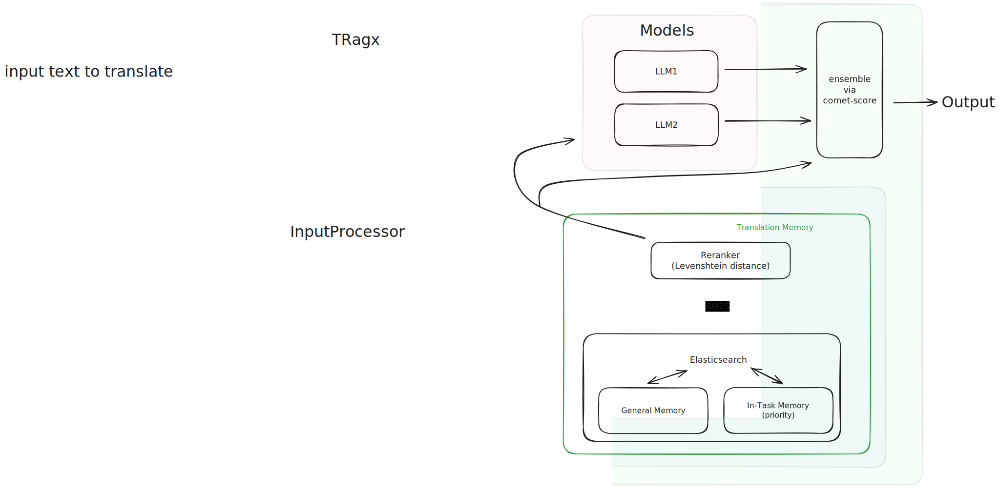

# System Overview

### Implementation Notes:

1. Running the LLMs as separate services would enable better scaling (i.e. using `OllamaModel` or `OpenAIModel`)
2. Each model handles its own prompt construction
3. The ensemble step is only triggered when using multiple models 
4. Currently not passing the translation memories directly to the ensemble model

